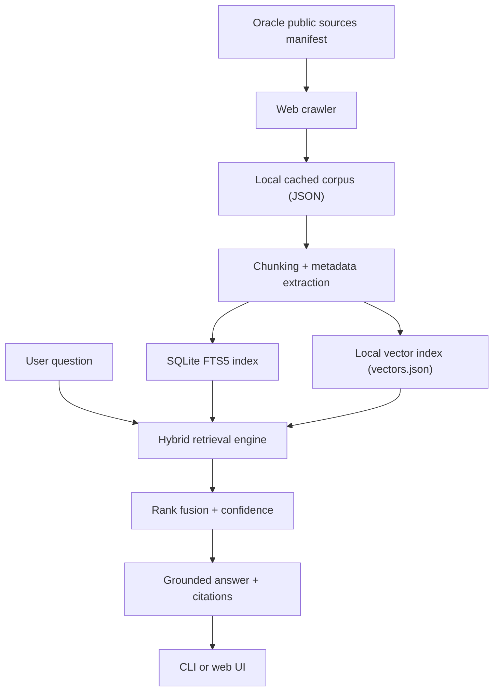

# Trusted Search

A local hybrid retrieval system inspired by the architecture in `Trusted Search Starter Kit.pdf`, adapted into a zero-dependency build that runs entirely on your machine.

It combines:

- `BM25` search using a real SQLite `fts5` index
- vector retrieval using a persisted dense index built from deterministic term projections
- grounded citations that point back to exact files and line spans

The project ships with a small source corpus so you can build and test the stack immediately, then replace it with your own documents.

## Quick start

```bash
python3 services/connector_python/ingest.py --source-dir sample_sources --index-dir data/index
python3 -m trusted_search search "how do citations stay grounded?" --index-dir data/index
python3 -m trusted_search answer "why combine BM25 and vector search?" --index-dir data/index
```

## What makes this "trusted"

- Every result comes from an actual local index, not an in-memory demo list.
- Citations include the exact file path and source line range for each chunk.
- The `answer` command only uses retrieved chunks as evidence and prints the supporting citations it used.
- The vector search is persisted to disk, so the retrieval layer is inspectable and reproducible.

## Python Folder Structure

```text
.
├── .env.example
├── apps/
│   ├── api/
│   └── api_python/
│       ├── __init__.py
│       └── main.py
├── packages/
│   └── trusted_search_py/
│       ├── __init__.py
│       ├── api.py
│       ├── connectors.py
│       ├── engine.py
│       ├── indexing.py
│       ├── models.py
│       └── settings.py
├── sample_sources/
├── services/
│   └── connector_python/
│       ├── __init__.py
│       ├── ingest.py
│       └── requirements.txt
└── tests/
    ├── integration/
    └── unit/
```

This keeps API code, shared package code, ingestion code, and tests separated in a more standard Python project layout.

## Replace the sample corpus

Point the builder at any directory of `.md` or `.txt` files:

```bash
python3 -m trusted_search build --source-dir /path/to/docs --index-dir data/index
```

The indexer chunks each file, stores chunk metadata in SQLite, and writes a vector index alongside it.

## Oracle ZDLRA + RMAN System

This repo can also build a public-source Oracle database protection assistant from Oracle docs and public Oracle blogs.

The source manifest lives at [data/oracle_public_sources.json](/Users/venky/Documents/Codex/2026-04-19-build-me-a-trusted-search-using/data/oracle_public_sources.json) and is seeded from current public Oracle pages covering:

- RMAN user and reference docs
- Recovery Appliance documentation and best practices
- Oracle MAA and infrastructure blog posts about ZDLRA and RMAN

Build the Oracle-focused corpus and index:

```bash
python3 -m trusted_search build-oracle \
  --manifest data/oracle_public_sources.json \
  --corpus-dir data/oracle_corpus \
  --index-dir data/oracle_index
```

Then query it:

```bash
python3 -m trusted_search search "How does ZDLRA reduce data loss?" --index-dir data/oracle_index --top-k 5
python3 -m trusted_search answer "What are Oracle best practices for RMAN with ZDLRA?" --index-dir data/oracle_index --top-k 5
```

For auditability, web-sourced documents are stored locally as JSON with the original `source_uri`, and citations in search results point back to the original Oracle URL plus chunk line span from the cached text.

## PDF-inspired ideas included

- separate connector and API entrypoints
- sample policy, HR, and finance sources
- ACL-aware filtering
- hybrid retrieval with confidence scoring
- citation-first answer output


